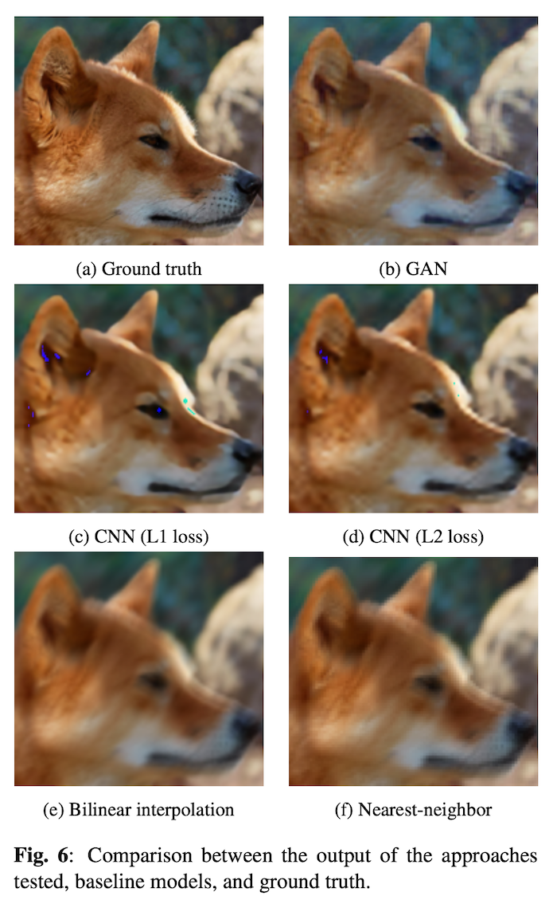

# Super resolution web app

## Description
This web app allows users to upload images, enhance their resolution, and download the improved images.

<!-- ## Deployment

This web app is deployed on [Heroku](https://www.heroku.com/). You can access it at:

[Image Resolution Enhancement Web App](https://super-resolution-e3a021fe68a2.herokuapp.com/) -->

## Installation
- Clone this repository
<pre>
git clone https://github.com/williamdevena/Super-resolution-web-app.git
cd Super-resolution-web-app
</pre>
- Install required dependencies using
<pre>
pip install -r requirements.txt
</pre>

## Usage
- Run the web app
<pre>
python app.py
</pre>
- Open the web app in your browser (default URL: http://localhost:5000)
- Upload an image, select the scale level, and click 'Upload'
- View the enhanced and original images side by side
- Download the enhanced image using the provided button

## Experiments execution

In addition to the web app, this repo contains the code used to implement, train and test the machine learning models.

For more details on the approaches proposed refer to the report **'SR_report.pdf'** contained in this repo.

<!--
This repo contains also the code and the report produced to tackle the Image Super resolution task.

**Dataset:** NTIRE 2017 Super Resolution Challenge (https://data.vision.ee.ethz.ch/cvl/ntire17/) -->

To execute and replicate the results written in the report run the file **'main.py'**. This should create two folders: **'project_log'** and **'ouput_images'.**

The first contains the file **'assignment.log'** where the results are going to be written, while the second contains the output images of all the proposed approaches:

- **nearest-neighbor (baseline)**
- **bilinear interpolation (baseline)**
- **PSNR-oriented CNN**
- **GAN**

The image below shows an example of the output of the proposed methods.

## Dataset

NTIRE 2017 Super Resolution Challenge (https://data.vision.ee.ethz.ch/cvl/ntire17/)

## Technologies Used
- Python
- PyTorch
- NumPy
- OpenCV
- Flask
- Javascript
- HTML
- CSS
- Bootstrap

